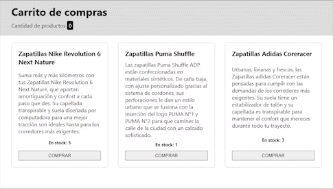

## Frontend III
# Primer Entregable

### Primer entregable de la materia Frontend III de la carrera Certified Tech Developer de Digital House.

La consigna es desarrollar el funcionamiento de un carrito de compras muy simple, que dado un listado de productos permita
mediante un boton agregar el producto al carrito, aumentando la cantidad de productos en carrito y disminuyendo el stock del producto
seleccionado. Cuando el stock del producto llegue a cero, deberá mostrarse como agotado y deshabilitar el click del botón.
El proyecto fue realizado con React.

### Instalación

1. Clonar el repositorio con ```git clone https://github.com/damianmicheli/entregable-fe3.git```
2. Ejecutar ```npm install``` para instalar las dependencias.
3. Iniciar el proyecto con ```npm start```.


### Demo 

Pequeña demostración del proyecto


